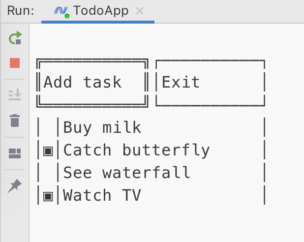

# Todo List Application

## Description 

This repository contain Todo List console application written on c#. Program was tested on MacOS and Linux. See screenshot below.

## Keymap

* Tab - switch between page widgets.
* Enter - activate button functionality or save task.
* Delete/Backspace - delete task.
* Space - mark task as completed.